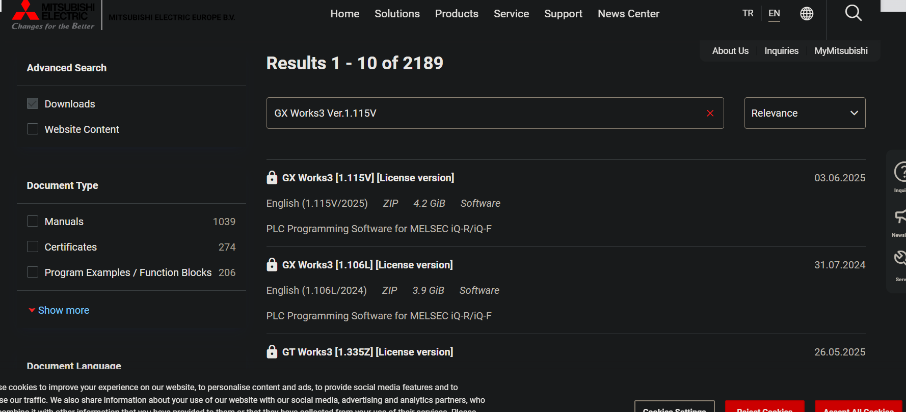
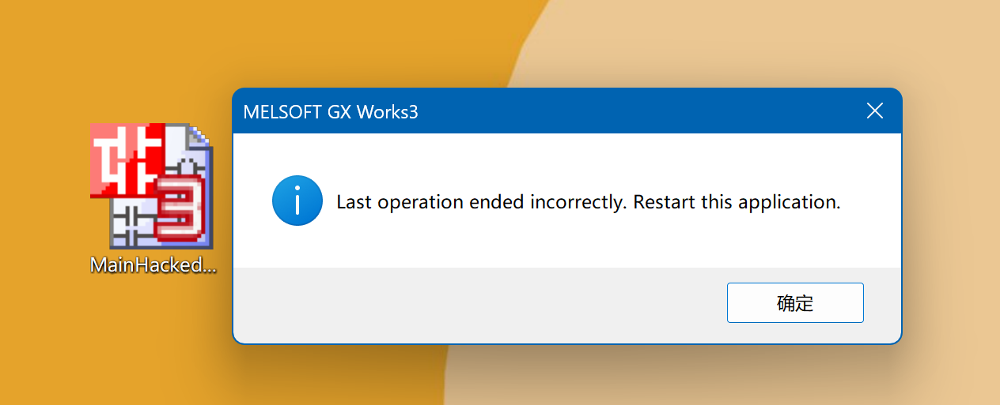
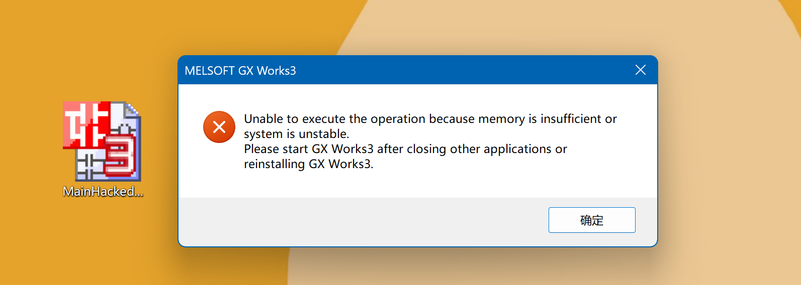
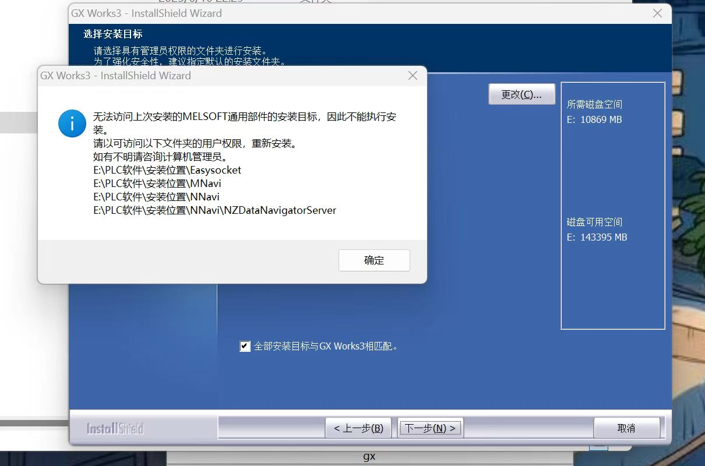
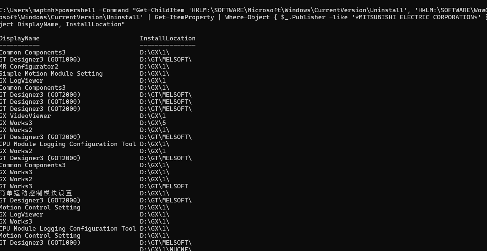
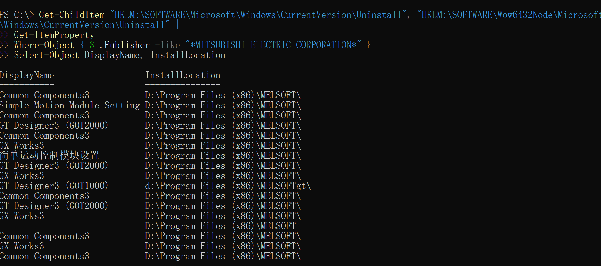
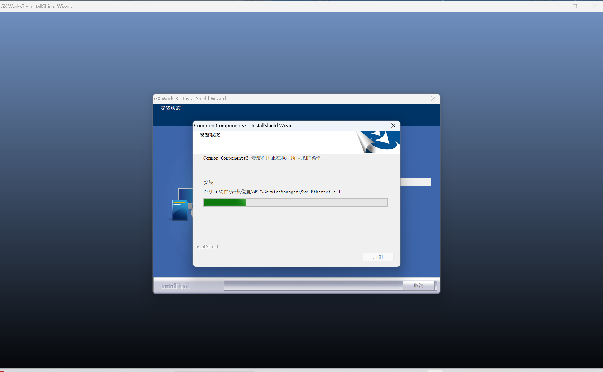
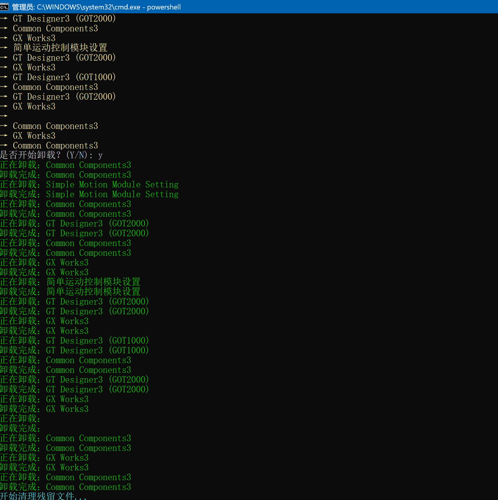

 
### **INFO**

**GX Works3 Version 1.115V Documentation Search:**

[Link to Documentation](https://tr.mitsubishielectric.com/fa/tr_en/advanced-search?q=GX+Works3+Ver.1.115V&ct=document)



#### **Error Messages:**

1. **Previous operation ended with an error, please restart this application.**
2. **Due to insufficient memory or system instability, the operation cannot be executed. Please close other applications or reinstall GX Works3 before restarting GX Works3.**
3. **Unable to access the target folder where the previously installed MELSOFT general parts are located, thus the installation cannot proceed. Please reinstall with user permissions that allow access to the following folder.**

   **Required disk space: 10,869 MB**

   **Paths:**

   * `E:\PLC Software\Installation Path\Easysocket`
   * `E:\PLC Software\Installation Path\MNavi`
   * `E:\PLC Software\Installation Path\NNavi`
   * `E:\PLC Software\Installation Path\NNavi\NZDataNavigatorServer`





#### **Error During Repair Attempt:**



### **Analysis & Solution:**

Through analysis, I discovered that this issue occurs after the initial installation of the software if the **MELSOFT folder** is mistakenly deleted. This **"danger signal"** will appear along with the **MSF file** being in use and unable to be deleted. Furthermore, the repair feature will not work in this case.

**Fix Location:** [F1X.zip Fix Release](https://github.com/MartinxMax/GX3-Fix/releases/download/Fix/F1X.zip)

Download the repair package `F1X.zip`.

#### **CMD Command to Get GX Installation Path:**

```powershell
powershell -Command "Get-ChildItem 'HKLM:\SOFTWARE\Microsoft\Windows\CurrentVersion\Uninstall', 'HKLM:\SOFTWARE\Wow6432Node\Microsoft\Windows\CurrentVersion\Uninstall' | Get-ItemProperty | Where-Object { $_.Publisher -like '*MITSUBISHI ELECTRIC CORPORATION*' } | Select-Object DisplayName, InstallLocation"
```



If you are using the default installation, it should be located in `C:\\Program Files (x86)`.



For example, copy and replace all the files from the `fix` directory into the specified location `E:\PLC Software\Installation Path\`.

Once done, rerun the installation process, and the reload screen will appear.



### **Removing GX3:**

If the issue cannot be resolved, the final method is to uninstall everything.

**Remove Script:** [remove.ps1](https://github.com/MartinxMax/GX3-Fix/blob/main/remove.ps1)

To remove all Mitsubishi products by brand name **MITSUBISHI**, download `remove.ps1`, and run the script via CMD in Administrator mode:

```powershell
powershell -Command "Set-ExecutionPolicy Bypass -Scope Process -Force; .\remove.ps1"
```



 